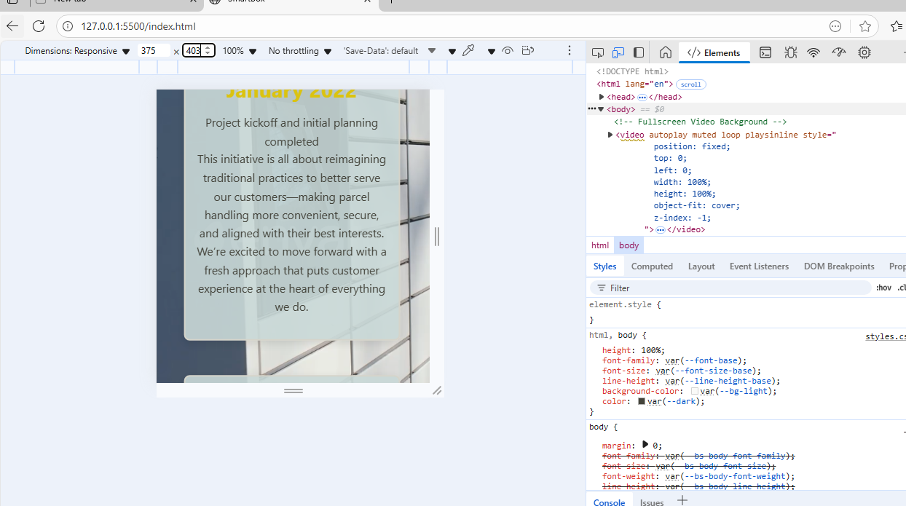
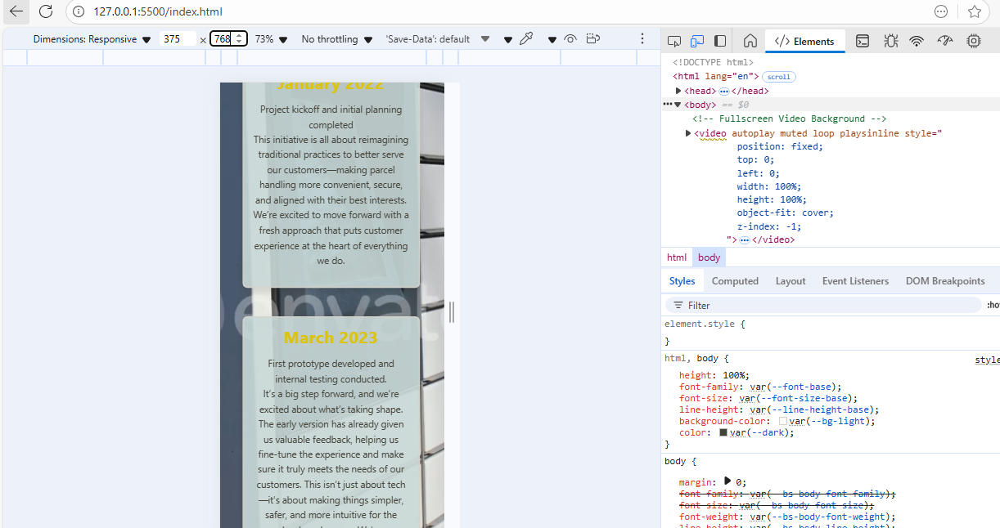
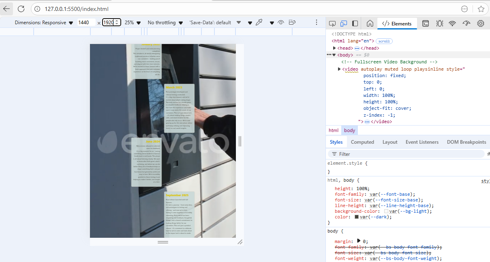

details has been shared regarding the structure of Readme file

📦 Project Title
Delivery Guy – SmartBox Website

Name: Zandile Gwala
GitHub: @Zandile250
Role: Developer with a passion for human-centered design, clear communication, and practical web solutions.

Project Overview
SmartBox is a modern moving and storage solution designed to simplify logistics for personal and commercial users. Instead of requiring customers to travel to a facility, SmartBox delivers the storage unit directly to them—offering convenience, flexibility, and peace of mind.

Website Goals and Objectives

- Provide an accessible platform for users to explore SmartBox’s services
- Enable enquiries and contact through responsive forms
- Communicate SmartBox’s value through clear design and interactive media
- Ensure usability across devices and screen sizes

Key Features and Functionality

- Intuitive Navigation: Clean menu structure for easy access to services and contact pages
- Responsive Design: Layout adapts to mobile, tablet, and desktop using media queries and Bootstrap
- Embedded Video: Demonstrates how parcels are accessed via SmartBox
- Interactive FAQ: Accordion component on service.html for user-friendly Q&A
- Form Validation & AJAX: Smooth enquiry process on contactUs.html
- Semantic HTML: Proper use of tags for accessibility and maintainability
- Google Map Embed: Shows SmartBox HQ in Bryanston, Sandton

Timeline and Milestones

- September: Planning and wireframes
- September: HTML structure and layout
- October: CSS styling and responsive design
- Novermber: Media integration and interactivity
- November: Testing, accessibility improvements, and documentation

web programe
Includes:

- Homepage (index.html) with consistent navigation
- Expanded aboutUs.html with company history, awards, reviews, and services
- Interactive service.html with accordion FAQ
- AJAX-enabled contactUs.html with validation
- Responsive gallery using Flexbox and CSS Grid
- CSS variables for scalable styling
- Hover and focus effects for accessibility

Sitemap
A visual site map outlines the structure and user journey across:

- Home
- About Us
- Services
- Contact
- Enquiries

Changelog
Files Updated:

- css/styles.css: Responsive styles, cleaned code
- index.html: Navigation bar, layout fixes, accessibility improvements
- aboutUs.html: Added detailed company info
- contactUs.html: Form validation and AJAX
- service.html: FAQ accordion
- utilsed Javascript in enhancing the web page

i tested pictures using different devices.

Here's how the site looks on different devices:

**Mobile (375px)**

**Tablet (768px)**

**Desktop (1440px)**

Responsive Design
Made the website work on different screen sizes using media queries:

- **Mobile (phones)**: Everything stacks vertically, buttons are full width
- **Tablet**: Two-column layout, medium-sized text
- **Desktop**: Full three-column gallery, bigger text, more spacing

-What I Tested
Checked the website on Chrome DevTools at 375px (mobile), 768px (tablet), and 1440px (desktop).

References

W3Schools. (2023). HTML <picture> Element. [online] Available at: https://www.w3schools.com/tags/tag_picture.asp [Accessed 28 Sep. 2025]
MDN Web Docs. (2024). CSS Flexible Box Layout. Available at: https://developer.mozilla.org/en-US/docs/Web/CSS/CSS_Flexible_Box_Layout
MDN Web Docs. (2024). CSS Grid Layout. Available at: https://developer.mozilla.org/en-US/docs/Web/CSS/CSS_Grid_Layout
Bootstrap Documentation. (2023). Bootstrap v5.3. Available at: https://getbootstrap.com/docs/5.3/
